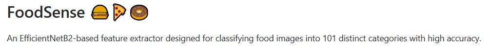
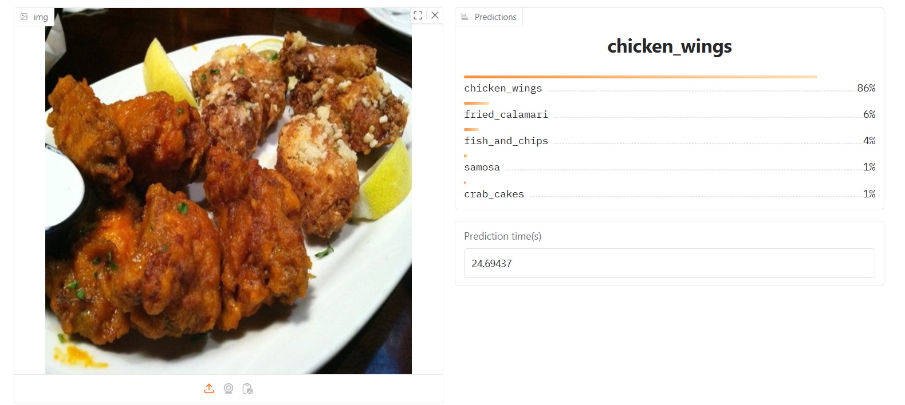

 

## 📌 Overview

**FoodSense** is an AI-powered food recognition model built using the **EfficientNetB2** architecture. Trained on the **Food-101 dataset**, it classifies food images into **101 distinct categories** with high accuracy. Whether you're a food blogger, nutritionist, or developer, FoodSense can help enhance your apps with intelligent image-based food classification.

---

## 🚀 Features

- 🍽️ Classifies 101 food categories (e.g., pizza, sushi, ramen, etc.)
- 🧠 Built with **EfficientNetB2** for strong performance vs. compute tradeoff
- ⚡ Fast and lightweight inference with optimized preprocessing
- 📊 Achieves high validation accuracy with good generalization
- 🔥 Trained using techniques and best practices from the **PyTorch for Deep Learning Bootcamp**

---

## 🏗️ Architecture

FoodSense uses **EfficientNetB2** as a feature extractor and adds a custom classification head. It was trained using transfer learning and fine-tuning on the Food-101 dataset.

